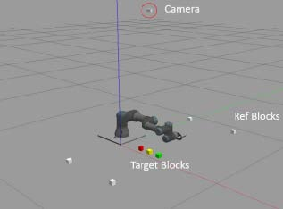
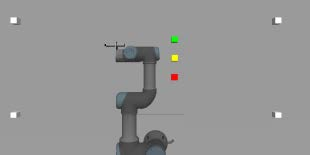
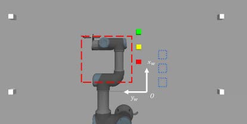
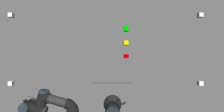
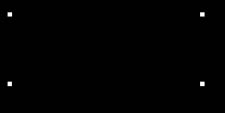
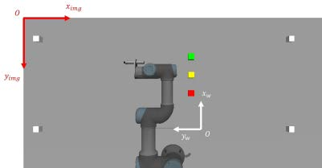

# ENME480 Final Project

# Pick and Place Task using Camera and UR3

## Objectives

The objective of this lab is to control the UR3 to move three colored blocks (AR-tagged in lab) to desired positions using camera image as inputs in Gazebo simulation. We will use OpenCV for processing the image data. The program will also integrate the functions of previous lab assignments. In this lab we will:
- Use OpenCV functions to find the centroid of each block
- Convert the pixel coordinates in an image to coordinates in the world frame
- Move the blocks from the detected positions to predefined desired positions

## Task Description

### Overview

A simulation environment for the project is shown in Figure 1.



In this lab, three colored blocks are the ‘target blocks’ to be moved by the UR3 from their initial positions to some predefined goal positions, which is the main task of this assignment. To do so, we need to find the centroid position of the top side of each target block. We use the image from a simulated ‘camera’ as the input to calculate the coordinates for guiding the UR3 robot. The camera is placed over the top of the work area. For ease of demonstration, the appearance of the camera is represented by a white rectangular block. The output image of the camera is simulated by adding Gazebo camera sensor plugin scripts into the ‘camera.urdf’ file with the topic name ‘/camera1/image_raw’. Figure 2 shows the image from the camera view at the initial instance. If you would like to check or save the image like this, open a new terminal when Gazebo is on and enter

```bash
ros2 run rqt_image_view rqt_image_view
```
and then select the rostopic `/camera1/image_raw`



In general, the image inputs from a camera need calibration before being used. To simplify this step, we add four white blocks in the simulation as the ‘reference blocks’. They are placed at fixed positions in the world frame and can contribute to converting positions inside the image to the world frame coordinates. In this way, we can avoid dealing with the camera calibration step in this assignment.
The expected outputs from your final program are:
- Randomly spawn the three colored blocks inside a predefined area
- Move the robot to the home position so that the camera can capture an image of the
entire work area
- Find and display the centroid of each colored block (x, y coordinates) in world frame
- Move the robot to pick up the colored blocks one at a time and place them at desired goal
positions
- Move the robot to the home position after finishing moving all target blocks
Lab setup. 
You can use the previous workspace to complete this lab. Download the script zip file and unzip the ‘lab5’ folder into the ‘src’ folder of the workspace. There are five python scripts in the
‘scripts’ folder:
- `main.py`: the main script to execute the entire program
- `spawn_blocks.py`: the script to generate blocks in Gazebo
- `find_block_pos.py`: the script to find the center position of a block of certain color from camera image and to convert image coordinates to world coordinates
- `kinematic_functions.py`: the script containing forward and inverse kinematics functions
from previous labs
- `hsv_finder.py`: the script to help find the appropriate HSV thresholds for different colors
(no edits/changes needed). 

The first four scripts need to be edited and completed for this lab assignment. The ‘hsv_finder.py’ file is a helper script and you don’t need to change anything or include it in the final program. Detailed explanations of each script will be described in the next section.

Running the program
After all scripts are completed, here is the procedure to run the entire program.

1. Compile the workspace, and enter in the first terminal
```bash
ros2 launch enme480_final final_project_main.launch
```

2. In the second terminal, run
```bash
ros2 run enme480_final spawn_blocks.py
```

After the blocks are displayed in Gazebo, you should be able to enter new commands in this
terminal. If so, enter

```bash
ros2 run enme480_final main.py
```
Then the UR3 will complete the whole task.

### Solution Procedure & Script Descriptions

A suggested solution procedure for the project is to handle the tasks sequentially in the following order:

| Step  | Script to Edit | Task | 
| :---------------: |:---------------:| --------:| 
| 1 | `spawn_blocks.py`| Generate random initial positions for target blocks |
| 2 | `find_block_pos.py` | Find centroid position of each colored block in world frame|
| 3 | `kinematic_functions.py`| Forward and inverse kinematics (from previous labs) |
| 4 | `lab5_main.py`| Execute to pick and place target blocks |

In this sequential order, the script to edit in each step can use the results from the previous steps, therefore it will be easier to debug the code when the outcome is not as expected. Note that ‘kinematic_functions.py’ in Step 3 is from Lab 3 and Lab 4 scripts, so no test should becneeded after editing it. On the other hand, it is also possible to divide the whole work and completes these tasks in parallel. To debug a specific function when working in this approach, you need the appropriate inputs and check whether your outputs are as expected. An appropriate input should be an expected output from other functions.

Next, we will describe the details of each script in the order shown in above table.

### `spawn_blocks.py`
When running this script, the reference blocks (white) and the target blocks (red, yellow, green) will be generated in the Gazebo simulation. The x and y coordinates of the center of one block in the world frame is represented by an 1 × 2 array. The coordinate directions and the origin are shown in Figure 3.



The four reference blocks are located at (0.0, 0.9), (0.5, 0.9), (0.5, −0.5), (0.0, −0.5) in the world frame. These values can be used to calculate the target block positions by converting pixel coordinates to world coordinates. In the given starter script, the red, yellow and green blocks are placed at (0.2, 0.05), (0.3, 0.05) and (0.4, 0.05), respectively. If these positions are fixed and known, then image inputs are no longer needed for detecting the block positions. Therefore, in the final program, the initial (x, y) positions of the three colored blocks should be randomized. In particular, we set the following requirements:
- Each x or y is a random number between 0.1 and 0.35, i.e., the three blocks will be
generated randomly in the red dashed square area in Figure 3. This ensures the blocks
can be reached by the UR3 robot.
- Since the coordinates are random, the blocks may collide with each other if the two
coordinates are very close. This will then fail the simulation. Hence, a clearance of 0.06
meters is desired for each pair of points generated.

Then by running this script, you will see the random initial position values from the terminal.
Record these positions and compare them with the calculated ones from the camera image in
the report.

### `find_block_pos.py`

The goal of this script is to find the centroid position of top side of a block. There are three
functions to be completed:
- `FindBlockByColor(image, color)`
- `FindBlockCenter(mask_image)`
- `PixelToWorld(target_block_center_pixel)`

OpenCV functions will be used in this script, so if compatibility issues occur due to version
conflicts, you would fix them here.

#### `FindBlockByColor`
This function returns a masked image showing the objects in an input image with an input color.
Figure 4 is an example showing the white color blocks from the camera image.





To distinguish different colors, we convert the RGB image to HSV color space. HSV stands for Hue, Saturation, Value of a pixel and a detailed description can be found using the reference links. Colors are placed on a color wheel, and you can select a color by selecting an angle range, which is Hue. In OpenCV this range is from 0 degrees to 180 degrees. Saturation is a number between 0 and 255 with 0 being very white and washed out and 255 the full, clear color. Value is also a number between 0 and 255 with 0 being very dark and shaded and 255 the full clear color. We use HSV color space to find a specific color more easily. 

You would need to find the appropriate lower and upper threshold values for showing the input color. To help with that, you can run the ‘hsv_finder.py’ script with python. You can adjust the
sliders to find appropriate HSV threshold values for a specific color.

#### `FindBlockCenter`
The input of this function is the masked image generated from ‘FindBlockByColor’ function. We
will use the OpenCV blob detector function to find the centroid positions of the blocks. In the
given script, it is not needed to edit anything for the detector. The only task is to obtain the centroid data ‘block_centers’ from the ‘keypoints’ variable. The ‘block_centers’ output should be an `n × 2` array, where n is the number of blocks found in the masked image. Each row represents x and y values of the pixel position of one centroid point.

As an example, in Figure 4 right image, there are four white blocks detected, so that the output `block_centers` is a `4 × 2` array. Then if you get a correct masked image for the red block, there
will be one centroid so ‘block_centers’ will return an 1 × 2 array.

#### `PixelToWorld`

In this function, you will use the outputs from previous functions to convert the centroid
positions of target blocks to the coordinates in the world frame.



The steps are as follows:

1. Find the centroid positions of the white blocks, which are pixel positions inside the 960 ×
480 image.
2. Pick the appropriate values from step 1 and the given positions of white blocks in world
frame to calculate the distance of each pixel in world frame in both x, y directions. 
3. Findthe centroid position of one target block and convert it to world frame coordinates. Note that the x, y directions and the origins of the image and world coordinates are different, as shown in Figure 5. 

The output from this function is the x, y coordinates in world frame of a certain target block as a list or an 1 × 2 array. With this information you are then able to command the UR3 to move here. Record the results for the randomly generated blocks, and compare them with the initial values from ‘spawn_blocks.py’ in the final report.

Finally, an optional `FindColorBlockWorldCoord(image, color)` function can be defined to integrate the above functions for easier use in the main script later. Feel free to change the definitions, variables, or structures of the functions or even adding new functions if that makes more sense to you.

### `kinematic_functions.py`
After obtaining the centroid positions in the world frame, you can command the UR3 to move there to grip them. In this script, you will use the functions for Lab 4 assignments to calculate the joint angles of UR3 from inverse kinematics. You can use Lab 3 functions to verify the solution.

### `main.py`
The final step is to edit the ‘main.py’ script. The functions for moving the arm and getting the image from the camera are provided. The ‘MoveBlock’ and ‘main’ functions are to be completed. ‘MoveBlock’ function moves one block from the starting (x, y) coordinates to goal (x, y) coordinates. You will use 'inverse_kinematics()', 'move_arm()' and 'gripper()' functions to complete this task. Note that 'inverse_kinematics()' requires the inputs of (x, y, z, yaw_angle). In this lab, yaw is set as 0 and (x, y) is found by the image input, so proper 'z' values should be defined for the gripper to touch the top side of the blocks. The height of base plate is 0.01 meters, and height of the block is 0.0318 meters. As a reminder, UR3 should not move directly from starting point to goal point with the 'z' value for gripping the block, because then the block is basically moved on ground and there can be other blocks in this trajectory. Instead, it should move upward first after gripping the block in order to have a clear space to move around, as we see in Lab 2 assignment. Finally in the ‘main’ function, you will use the completed functions to move the red, yellow and green blocks to the defined goal positions, located at the blue dashed squared squares in Figure 3. The 'current_img' is from the ‘raw_image’ attribute of the ‘ImageConverter’ class, which you will use to calculate the centroid positions. There can be OpenCV compatibility issues with this script as well. You can search online for solutions when encountering them. Feel free to contact TAs or raise questions on Piazza for help at any time.