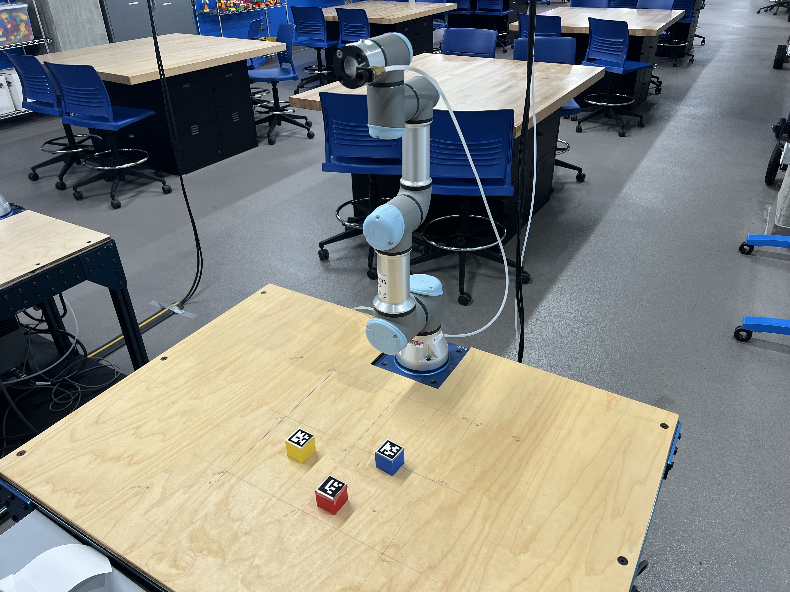

# ENME480 Final Project - Pick and Place Task using UR3e

## Objective

The objective of this project is to control the UR3e to move (at least) three AR-tagged blocks to desired positions using camera image as inputs. We will use OpenCV for processing the image data. The program will also integrate the functions of previous lab assignments. The major objectives are the following
- Use OpenCV functions to find the centroid of each block
- Convert the pixel coordinates in an image to coordinates in the world frame using a perspective matrix
- Move the blocks from the detected positions to predefined desired positions

## Task Description

The lab environment is shown below:



You will be given 3 blocks with different Aruco markers. Your task is to move them out of the workspace into predefined positions. To do so, you will need to find the centroid postion of the top side of each block with an image from the camera mounted above the table, facing down on the workspace. You will convert the detected pixel coordinates to the table frame using a persepctive transform. Then using your inverse kinematics solution, you will pick up the block using a suction gripper mounted at the end effector. Your task is to place each block at a specific location outside the workspace.


## Overview of the ROS Package

The project package should be located on the local lab machines in RAL. You can also find the package with redacted scripts here: https://github.com/ENME480/enme480_project.

The nodes have been added to the `setup.py` file, so you do not need to add that. You will find five scripts as listed in the table below:

| Script Name  | Description       | 
| :---------------: |:---------------|
| `get_perspective_warping_with_aruco.py` | Script to create the perspective matrix |
| `aruco_detection_test.py` | Script to test the perspective transform and get coordinates of the blocks in table frame | 
| `block_detection_aruco.py` | ROS Node for detecting blocks, uses the same function and changes from `aruco_detection_test.py`| 
| `kinematic_functions.py` | Script to insert all of your FK and IK functions from previous labs | 
| `main_pipeline.py` | The main pipeline to strategize and sequence movement of the blocks | 

Please do not edit anything outside the given code snippets (it will lead to errors which will be difficult to identify)

## Procedure for Setup in RAL

Please follow the following steps before you start editing the scripts on RAL machines

1. UR3e Setup

    - Power on the robot
    - Release the brakes

2. Restore the package to original form and pull the latest version

```bash
cd rosPackages/ENME480_ws/src/enme480_project
git checkout .
git pull
```

3. Interfacing the Robot with PC

The robot connections and configuration has been setup. You have to interface the robot with ROS to receive and send comands.

- Find the `commands2run.txt` file on the Desktop
- Follow instructions in the file to get the robot interfaced with ROS

## Script Descriptions

You are recommended to complete each script in the order suggested in the table. 

### `get_perspective_warping_with_aruco.py`

This script will generate a perspective matrix for the camera to table frame. You need to edit one line to input the reference points on the table. Ensure that you are entering the values in `mm`. This script will generate a `perspective_matrix.npy` file in the folder.

Before you run this script, ensure that you are in the correct directory. Assuming you have already entered the docker container, run

```bash
cd ENME480_ws/src/enme480_project/enme480_project/
python3 get_perspective_warping_with_aruco.py
```

Once run, you will see a window with the live camera feed. Click on the reference points in the same order that you have listed in your script. It will calulate the perspective transform and a new window will pop-up showing a blue dot at `(175,175)` on the table coordinate frame. If this is right, you can proceed to the next script.


### `aruco_detection_test.py`

This script will give you a live detection of the aruco markers and their location w.r.t the table frame in real-time. You need to modify the `image_frame_to_table_frame()` function in the script. Use the math from prespective transforms to do the same. You can find a file discussing perspective transforms in the main folder on this repository.

### `block_detection_aruco.py`

This is the ROS node and a Python class for all the functions in the `aruco_detection_test.py` script. If your `aruco_detection_test.py` could detect the block coordinates correctly, please copy the same function to the snippet for `image_frame_to_table_frame()` function in this script as well.

You can test this script by running the following command

```bash
ros2 run enme480_project aruco_tracker
```

It will publish data under two topics `/aruco_detection/image` and `/aruco_detection/positions`

You can view the image using 

```bash
ros2 run rqt_image_view rqt_image_view
```

and it should show the same image in the window as the one you saw with `aruco_detection_test.py`, once you select the topic.

### `kinematic_functions.py`

This script will use your functions from previous labs and if you have the script working correctly for your FK and IK labs, you can copy the exact same functions here under the functions `calculate_dh_transform()` and `inverse_kinematics()` within the given snippets. We need to verify if your IK script is working correctly so please call the TAs over top show your final IK code working before you copy this.

### `main_pipeline.py`

This script is where you will sequence and startegize the pick and place process. In this script, you have to edit the following functions:

1. `move_arm()`

    This function will take in the desired joint positions and publish them using the message data structure given in code comments

2. `gripper_control()`

    This function will take in the desired state of the gripper and publish it using the message data structure given in code comments

3. `move_block()`

    Here, you need to work on giving the sequence of positions you want the block to move to for moving a block from an initial position to a final position. Keep in mind that every block needs to be picked up, raised up and then moved. Do not give it a sequence to drag it accross the table.

4. `process_blocks()`

    This function is where you will enter the startegy and sorting method to place the blocks in their desired positions given their IDs, pre-defined destinations.


Once everything is ready, call the TAs over before you execute the node

```bash
ros2 run enme480_project main_pipeline
```

## Optional Assignments

under construction....
