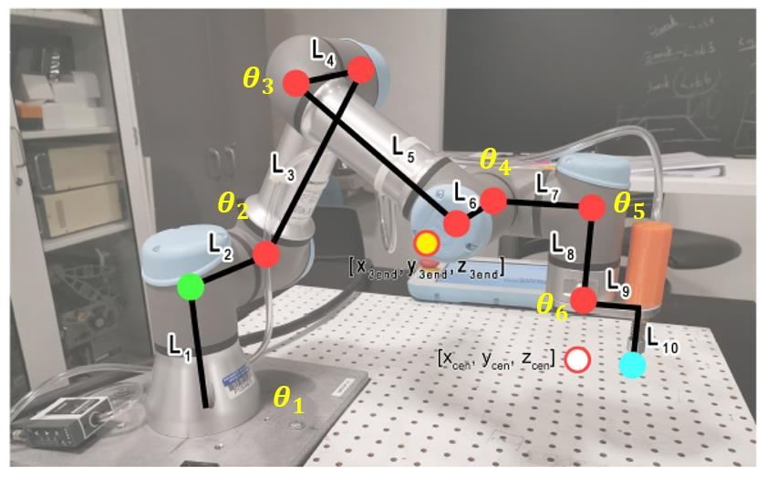
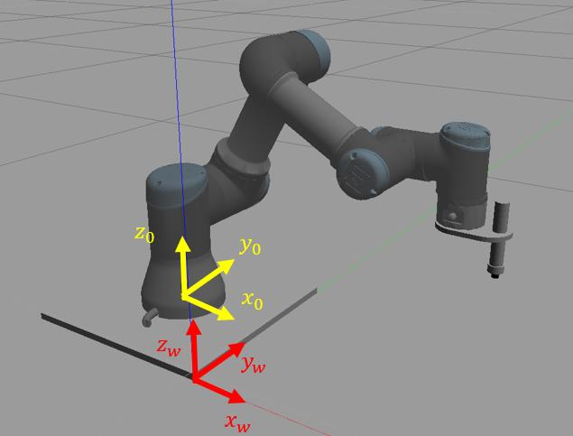
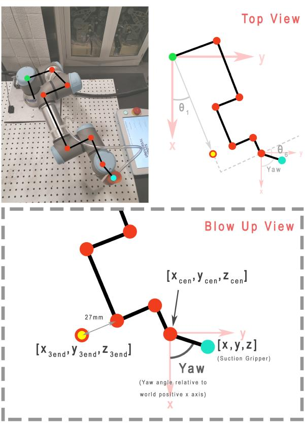
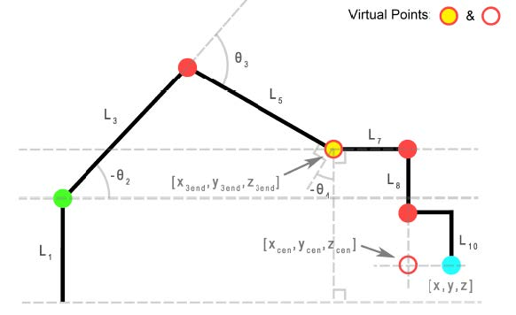

# Week 7 - UR3e Inverse Kinematics on Gazebo

## Objectives

The objective of this lab is to derive and implement a solution to the inverse kinematics problem for the UR3 robot. In this lab we will:

- Derive elbow-up inverse kinematic equations for the UR3
- Write a publisher that moves the UR3 to a point in space specified by the user

## Task Description

The joints and links of the UR3 robot are annotated in Figure 1. The goal is to find the rotation
angles of the 6 joints `(θ1, ... , θ6)`, so that the end-effector (end of Link 10) can reach to a given
position `(x_grip, y_grip, z_grip)` and orientation `{θ_yaw, θ_pitch, θ_roll}` input by the user.
There are many possible solutions to the inverse kinematics problem. To make the derivation
manageable, we will only implement one of the elbow-up solution in this lab. `θ_pitch` and `θ_roll` of
the end-effector are fixed by letting the vacuum gripper aluminum plate (Link 9) always be
parallel to the x-y plane of world frame coordinates (i.e., desk plane), and θ5 is always equal to −90°. Thus, the user will input the desired position and yaw angle of the end-effector in world
frame coordinates `(xWgrip, yWgrip, zWgrip, yawWgrip)`, and the output of the program should
be the joint angles `θ1 to θ6`.



## Solution Steps

In this section, a suggested solution approach is described.

1. Establish the world coordinate frame (frame w) centered at the corner of the UR3’s base shown in Figure 2. We will solve the inverse kinematics problem in the base frame (frame 0), so we will convert the coordinates (𝑥𝑤−𝑔𝑟𝑖𝑝, 𝑦𝑤−𝑔𝑟𝑖𝑝, 𝑧𝑤−𝑔𝑟𝑖𝑝) entered by the user to base frame coordinates (𝑥𝑔𝑟𝑖𝑝, 𝑦𝑔𝑟𝑖𝑝, 𝑧𝑔𝑟𝑖𝑝). The origin of the base frame is at (-0.15, 0.15, 0.01) in
the world frame. Set 𝜃5 = −90° in unit of radian."



2. We will define a “wrist center” as 𝑧𝑐𝑒𝑛 which equals the same desired 𝑧 value of the vacuum gripper, and 𝑥𝑐𝑒𝑛, 𝑦𝑐𝑒𝑛 are the coordinates of `𝜃6`’s 𝑧 axis (see Figure 1). Link 9 (gripper plate) has a length of 0.0535 meters from the center line of the gripper to the center line of Joint 6. Given the desired position of the gripper `(𝑥𝑔𝑟𝑖𝑝, 𝑦𝑔𝑟𝑖𝑝, 𝑧𝑔𝑟𝑖𝑝)` in the base frame and the yaw angle, find wrist’s center point (𝑥𝑐𝑒𝑛, 𝑦𝑐𝑒𝑛, 𝑧𝑐𝑒𝑛).
3. Given the wrist’s center point (𝑥𝑐𝑒𝑛, 𝑦𝑐𝑒𝑛, 𝑧𝑐𝑒𝑛), find the waist angle 𝜃1. Figure 3 shows the
top-down view of the robot, which is helpful for formulating the relations.
4. Solve for the value of `𝜃6`, given 𝜃1 and the desired yaw angle (should be converted to radian from the input degree value). 𝜃6 = 0 when Link 9 is parallel to Link 4 and Link 6.
5. We will define another virtual point. A projected end point (𝑥3𝑒𝑛𝑑, 𝑦3𝑒𝑛𝑑, 𝑧3𝑒𝑛𝑑) is a point off the UR3 but lies along the Link 6 axis, as shown in Figure 1 and Figure 3. For example, if 𝜃1 = 0 then 𝑦3𝑒𝑛𝑑 = 0. If 𝜃1 = 90° then 𝑥3𝑒𝑛𝑑 = 0. Use the top-down view (Figure 3) to find 𝑥3𝑒𝑛𝑑 and 𝑦3𝑒𝑛𝑑 from 𝑥𝑐𝑒𝑛, 𝑦𝑐𝑒𝑛. Figure 4 is a side view that is a projection of the robot onto a plane
perpendicular to the x-y plane of world frame and rotated by 𝜃1 about the base frame. From
this figure we can see that 𝑧3𝑒𝑛𝑑 is 𝑧𝑐𝑒𝑛 offset by a constant. The end of the gripper is 0.052m from the center of the gripper plate in the z-axis direction.





6. Find 𝜃2, 𝜃3 and 𝜃4 from the end point (𝑥3𝑒𝑛𝑑, 𝑦3𝑒𝑛𝑑, 𝑧3𝑒𝑛𝑑). In Figure 4, a parallel to the base construction line through Joint 2 and a parallel to the base construction line through Joint 4 are helpful in finding the needed partial angles. 𝜃2 and 𝜃3 can be found from the geometry, while 𝜃4 is determined due to the requirement that Link 7 and Link 9 must be parallel to the
x-y plane of the world frame.

Now that your code solves for all the joint variables `(𝜃1 to 𝜃6)`, send these six values to the publisher you created in FK lab to move the robot to those angles so that it gets to the desired position.

## Implementation in ROS2 & Gazebo

1. Pull the latest commit for ur3e_enme480 package

```bash
cd ~/<your_workspace>/src/ur3e_enme480
git pull
```

2. Download the URDF `enme480_ik.xacro` (from `Code Resources` in Week 7 on this page) in your `urdf` folder. Change the filename accordingly in your `ur.urdf.xacro`.

Add the `UR3SuctionCupMount.stl` from `Code Resources` to your `Universal_Robots_ROS2_Description//meshes/ur3/visual/` folder.

3. Create a publisher `ur3e_ik_sim.py` with node name `ur3e_sim_ik_publisher`. It will have a structure somewhat like this:

```python
import ....

class InverseKinematicsUR3e(...)

  def __init__(self): 
    ...
    ...
    self.publisher_ = self.create_publisher(CommandUR3e, '/ur3/command', 10)
    ...
    ...

  def move_robot(...):
    ...
    ...

  def calculate_fk_from_dh(...):
    ...
    ...

  def inverse_kinematics(self, xWgrip, yWgrip, zWgrip, yawWgrip):

    # TODO: Function that calculates an elbow up 
	# inverse kinematics solution for the UR3

	# Step 1: find gripper position relative to the base of UR3,
	# and set theta_5 equal to -pi/2


	# Step 2: find x_cen, y_cen, z_cen


	# Step 3: find theta_1
	

	# Step 4: find theta_6 
	

	# Step 5: find x3_end, y3_end, z3_end
	

	# Step 6: find theta_2, theta_3, theta_4

    # Return the set of joint angles to move the robot

    
def main(...):

  ...
  ...

if __name__ == '__main__':
  main()
```

You command should look like this:

```bash
ros2 run <package_name> ur3e_sim_ik_publisher <x> <y> <z> <Yaw>
```

